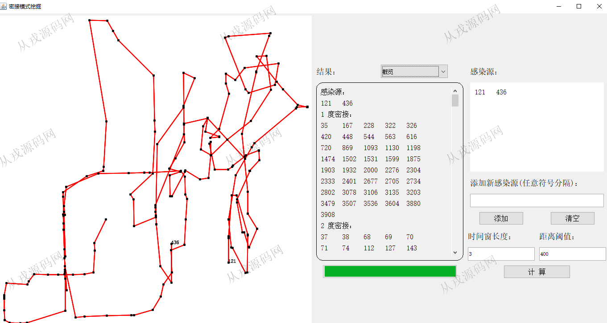
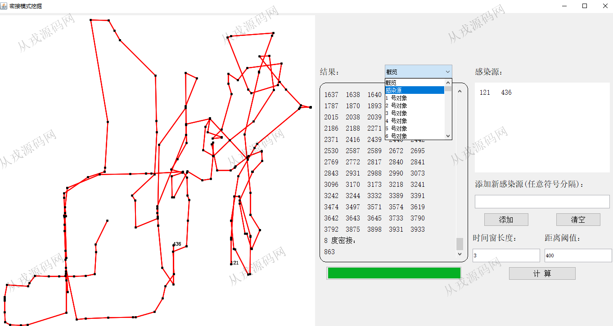
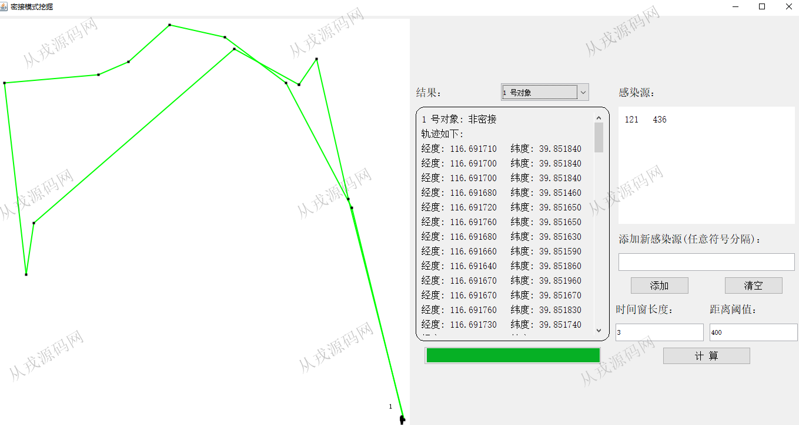
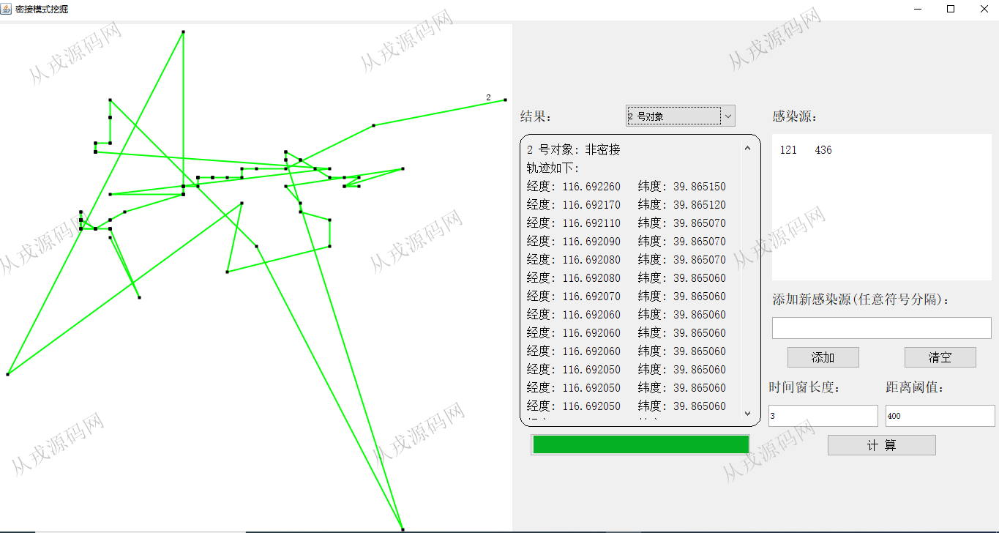
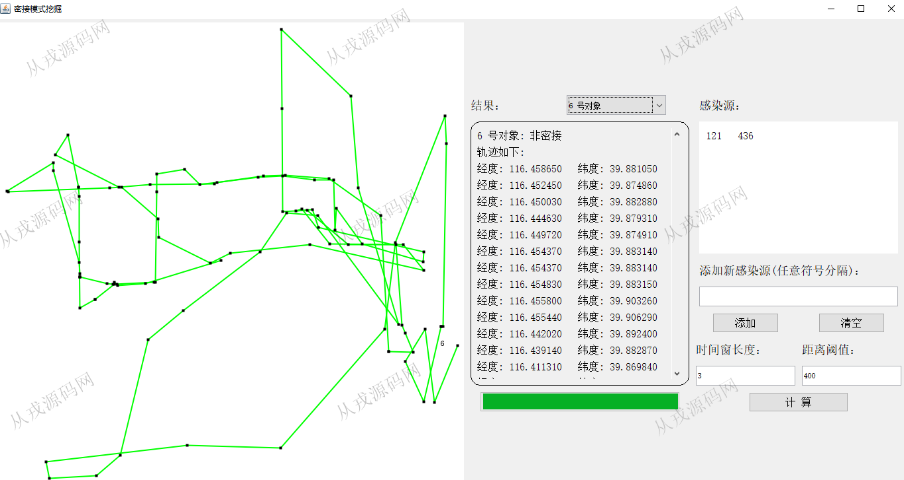

<h1 align="center">195.新冠密接模式挖掘管理系统</h1>

 获取data文件 QQ: 386869957 QQ群: 377586148 

 [更多源码项目: 从戎源码网](https://armycodes.com/) 

## 简介

> 本代码来源于网络,仅供学习参考使用!
>
> 提供1.远程部署/2.修改代码/3.设计文档指导/4.框架代码讲解等服务

## 项目介绍
基于java+awt+swing新冠密接模式挖掘管理系统：借助数据的经纬度坐标，计算接触人员之间关系

## 环境

- <b>IntelliJ IDEA 2021.3</b>
- 
- <b>JDK 1.8</b>

## 运行截图

